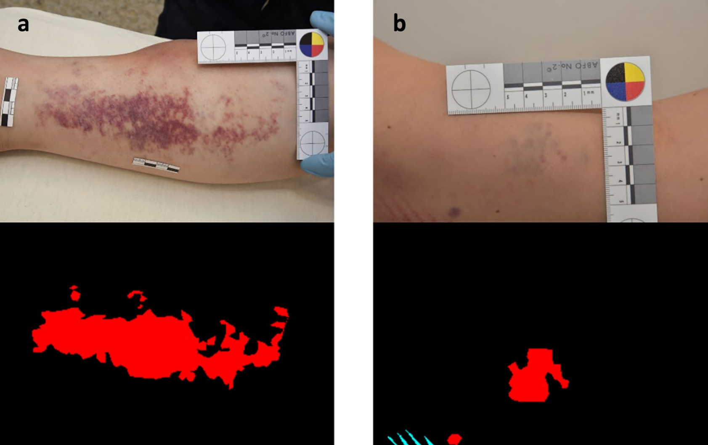
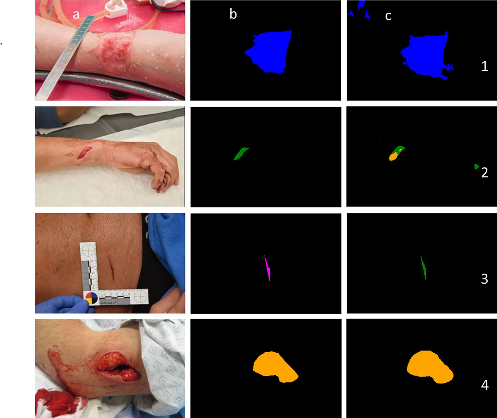
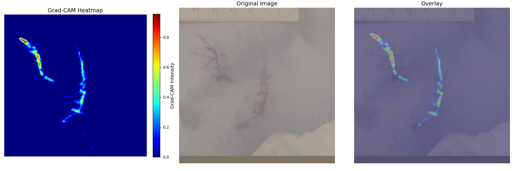

# Automatic Segmentation and Classification of Forensic Wound images



---

## Project Overview

- This project provides a robust pipeline for **automatic detection, classification, and segmentation of forensic wounds** using state-of-the-art deep learning models, including CNNs and transformers.  
- It is designed for flexibility, reproducibility, and easy experimentation with hyperparameters and augmentations.
- The models were trained using 2000 images of forensic wounds.
- Models were evaluated using IoU and F1 score.

---

## Features

- **Configurable pipeline**: All hyperparameters, augmentations, and model settings are controlled via JSON config files.
- **Supports multiple architectures**: UNet, UNet++, DeepLab, HuggingFace transformers (e.g., Swin).
- **YOLO-based wound detection** for bounding box proposals and cropping (used to generate new cropped and zoomed images out of the already available images)
- **Flexible data augmentation**: All augmentation types and probabilities are set in the config.
- **Binary and multiclass segmentation** with easy switching.
- **Micro/macro F1 score selection** for evaluation.
- **Easy class merging/exclusion** for rare or unwanted classes.

---

## Setup & Usage

### 1. **Preprocessing**

Run the preprocessing scripts to:
- Resize and save new images
- Calculate class weights for segmentation
- Train a YOLO model for wound detection

```bash
python New_Code/preprocessing/preprocessing.py
python New_Code/preprocessing/weights.py
python New_Code/preprocessing/yolo.py
```

### 2. **Configuration**

All settings are in the config files:

- `New_Code/configs/training_config.json`
- `New_Code/configs/preprocessing_config.json`

**Key things to configure:**
- **Paths**: Set your data and output directories.
- **Segmentation mode**: `"binary"` or `"multiclass"`
- **Model & encoder**: Choose architecture and encoder.
- **Augmentations**: Enable/disable and tune all augmentations.
- **Hyperparameters**: Learning rate, batch size, epochs, optimizer, etc.
- **F1 Score Type**: Set `"f1_average": "macro"` or `"micro"` in `training_config.json`.

### 3. **Training**

Run the main training script:
```bash
python New_Code/training/Main_gridsearch.py
```
Or, for transformer-based models:
```bash
python New_Code/training/Main_transformer.py
```

### 4. **Prediction & Evaluation**

Use the prediction script to segment new images:
```bash
python New_Code/training/prediction.py
```

---

## Classes

| ID  | Name (EN)                | Name (DE)                  |
|-----|--------------------------|----------------------------|
| 0   | background               | background                 |
| 1   | dermatorrhagia           | ungeformter bluterguss     |
| 2   | hematoma                 | geformter bluterguss       |
| 3   | stab                     | stich                      |
| 4   | cut                      | schnitt                    |
| 5   | thermal                  | thermische gewalt          |
| 6   | skin abrasion            | hautabschürfung            |
| 7   | puncture-gun shot        | punktförmige-gewalt-schuss |
| 8   | contused-lacerated       | quetsch-riss Wunden        |
| 9   | semisharp force          | Halbscharfe Gewalt         | -> keine klare definiton
| 10  | lacerations              | risswunden                 |

**Removed classes**: 11–14 (merged into class 6)

**Rare classes**: 3, 7, 9 (can be excluded via config)

---

## Experimentation

- **Switch between binary and multiclass**:  
  Change `"segmentation"` and `"segmentation_classes"` in the configs.
- **Try different models**:  
  Change `"encoder"` or use `"transformer"` for Swin/ViT.
- **Tune augmentations**:  
  Edit `"augmentation_settings"` in the config.
- **Grid search**:  
  Enable and configure in `training_config.json`.
- **F1 Score**:  
  Choose `"macro"`, `"micro"`, `"weighted"`, or `"none"` via `"f1_average"` in `training_config.json`.


---

## Best Models

| Mode      | Model Filename                                                                 | IoU    | F1     |
|-----------|-------------------------------------------------------------------------------|--------|--------|
| Binary    | `best_model_v1.5_epoch21_encoder_timm-efficientnet-l2_seg_binary_lambda5_optadamw_lr0.0003_dice+ce_wr50_200_samplerFalse_iou0.8005_f10.8746.pth` | 0.8005 | 0.8746 |
| Multiclass| `best_model_v1.5_epoch32_encoder_timm-efficientnet-l2_seg_multiclass_lambda5_optadamw_lr0.0003_dice+ce_wr50_200_samplerFalse_iou0.4858_f10.5855.pth` | 0.4858 | 0.5855 |

---

## Example Results


<div style="font-size: 1.5em; font-family: 'Arial Black', Arial, sans-serif; margin-bottom: 1em;">
  Sample input, ground truth, and predicted mask
</div>

---

## Model Interpretability: Grad-CAM Visualizations

This project integrates **Grad-CAM** (Gradient-weighted Class Activation Mapping) to provide visual explanations for model predictions, helping to understand which regions of an image most influence the model's decisions, making model decisions more transparent and interpretable.

### How Grad-CAM is Used in This Project
- **Automatic During Training:**
  - If `"gradCAM": true` is set in  `training_config.json`, Grad-CAM visualizations are automatically generated for a few validation samples every N epochs during training.
  - The visualizations are saved in the `gradcam_outputs/` directory as image files.


### Example Output
Below is a sample grid of Grad-CAM visualizations. Each row shows:
- The Grad-CAM heatmap
- The original image
- The overlay of heatmap on the image




### Why Use Grad-CAM?
- **Debugging:** See if the model is focusing on the correct regions.
- **Trust:** Build confidence in model predictions for clinical or research use.
- **Insight:** Identify failure cases or dataset/model biases.

---

## Notes

- All code is modular and easy to extend.
- Due to privacy, the data used to train the model is not publicly available
- For questions or contributions, open an issue or pull request!
---

